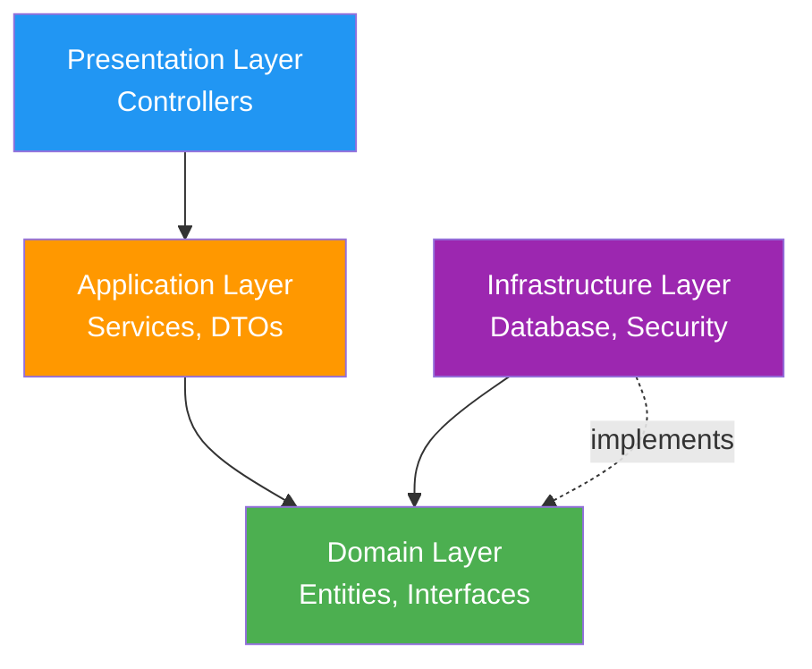
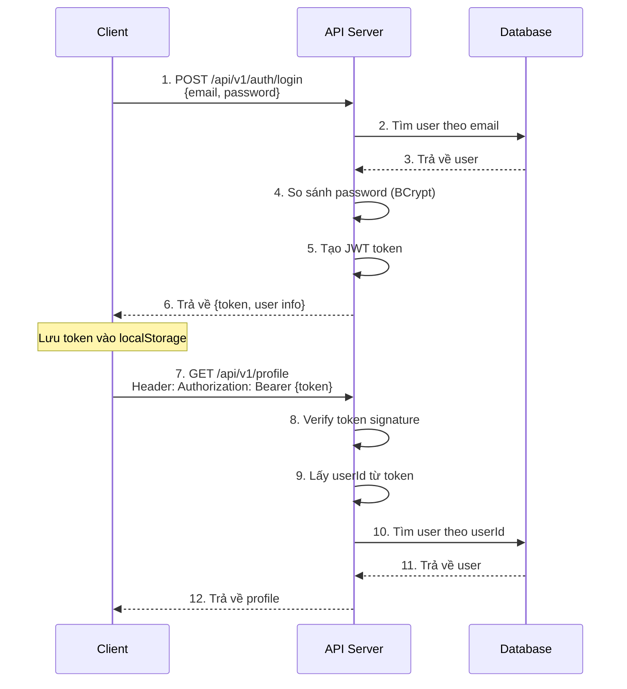
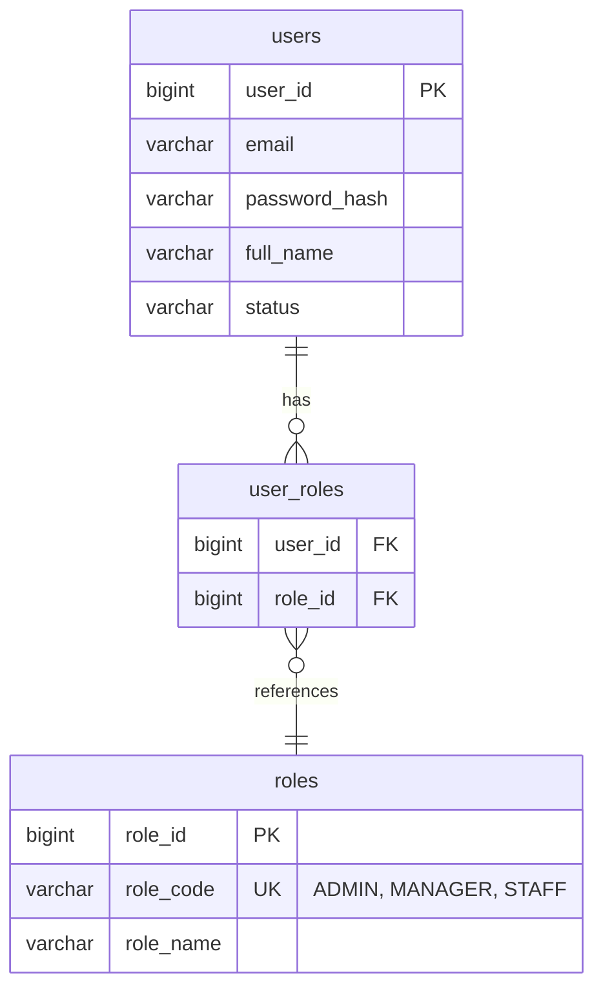
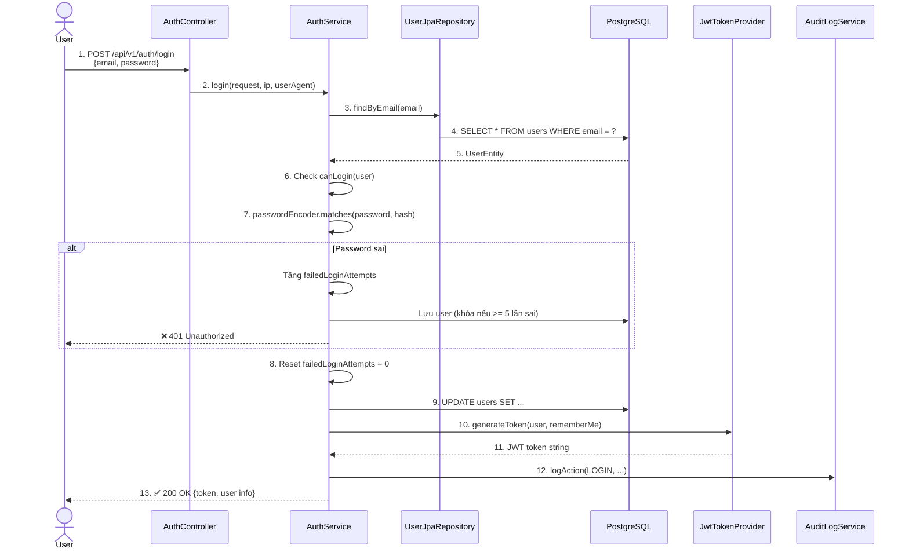
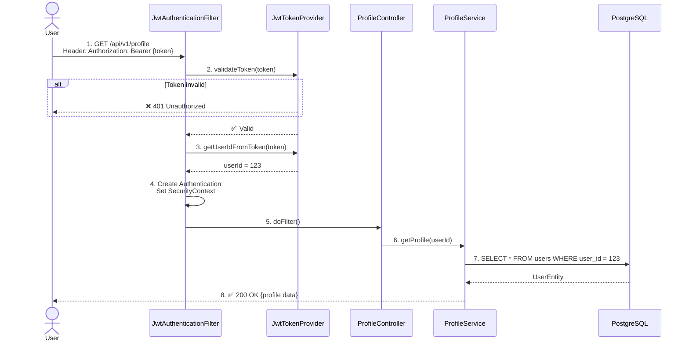
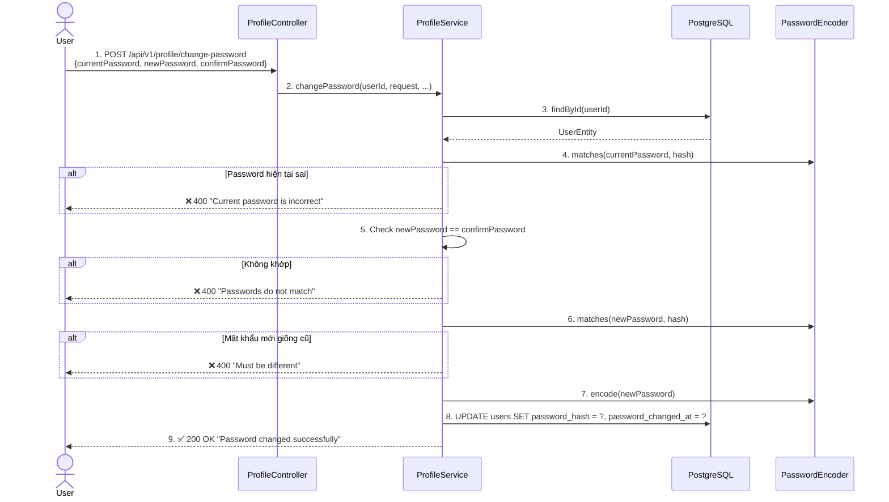

# 📘 Giải Thích Toàn Diện Dự Án SEP26 Warehouse Management System

> **Tài liệu này giải thích chi tiết các khái niệm, kiến trúc và luồng hoạt động của hệ thống**

---

## 🎯 Tổng Quan Hệ Thống

**SEP26 Warehouse Management System** là một hệ thống quản lý kho hàng hóa chất được xây dựng theo mô hình **Clean Architecture**, sử dụng:

- **Backend**: Spring Boot 3.2.0 + Java 17
- **Database**: PostgreSQL 15
- **Security**: JWT (JSON Web Token)
- **Documentation**: Swagger/OpenAPI

### Mục Đích Của Hệ Thống
- Quản lý người dùng với phân quyền động (roles)
- Xác thực và phân quyền an toàn (JWT)
- Quản lý profile cá nhân
- Ghi log audit trail cho các hành động quan trọng
- Gửi email thông báo

---

## 📚 CÁC KHÁI NIỆM QUAN TRỌNG

### 1️⃣ Clean Architecture (Kiến Trúc Sạch)

Clean Architecture chia hệ thống thành **4 tầng (layers)** với nguyên tắc quan trọng: **Dependencies chỉ được hướng vào trong** (inward).



#### Tại Sao Lại Dùng Clean Architecture?

✅ **Tách biệt rõ ràng**: Mỗi tầng có trách nhiệm riêng, dễ maintain  
✅ **Độc lập framework**: Business logic không phụ thuộc vào Spring Boot, PostgreSQL  
✅ **Dễ test**: Có thể test từng tầng độc lập  
✅ **Linh hoạt**: Có thể thay đổi database (PostgreSQL → MongoDB) mà không ảnh hưởng business logic

---

### 2️⃣ JWT (JSON Web Token) - Xác Thực Không Trạng Thái

JWT là một chuẩn mã hóa thông tin thành **token** để xác thực người dùng.

#### Cấu Trúc JWT
```
eyJhbGciOiJIUzI1NiJ9.eyJzdWIiOiJ1c2VyQGV4YW1wbGUuY29tIiwicm9sZXMiOlsiQURNSU4iXX0.signature
│─────────────────│ │──────────────────────────────────────────────────│ │─────────│
     Header                        Payload                                Signature
```

**Ví dụ payload (dữ liệu)**:
```json
{
  "sub": "user@example.com",        // Email người dùng
  "userId": 123,                      // ID người dùng
  "roles": ["ADMIN", "MANAGER"],      // Danh sách quyền
  "iat": 1612345678,                  // Thời gian tạo
  "exp": 1612432078                   // Thời gian hết hạn
}
```

#### Luồng Hoạt Động JWT



#### Ưu Điểm JWT
- ✅ **Stateless**: Server không cần lưu session, dễ scale
- ✅ **An toàn**: Chống giả mạo nhờ chữ ký (signature)
- ✅ **Tiện lợi**: Client tự quản lý, gửi kèm mỗi request

---

### 3️⃣ DTO (Data Transfer Object) - Đối Tượng Truyền Dữ Liệu

DTO là các class đơn giản chỉ chứa dữ liệu, dùng để **truyền dữ liệu giữa các tầng**.

#### Tại Sao Cần DTO?

🔒 **Bảo mật**: Không expose toàn bộ Entity (ví dụ: không trả về `passwordHash`)  
🎯 **Linh hoạt**: API có thể thay đổi mà không ảnh hưởng Entity  
📦 **Tối ưu**: Chỉ truyền dữ liệu cần thiết

#### Ví Dụ Entity vs DTO

**Entity** (lưu trong database):
```java
public class User {
    private Long userId;
    private String email;
    private String passwordHash;     // ⚠️ Không được lộ ra ngoài
    private String fullName;
    private Set<String> roleCodes;
    // ... nhiều field khác
}
```

**DTO** (trả về cho client):
```java
public class UserResponse {
    private Long userId;
    private String email;
    private String fullName;
    private Set<String> roleCodes;
    // ✅ Không có passwordHash
}
```

---

### 4️⃣ Roles (Phân Quyền Động)

Hệ thống sử dụng **phân quyền động từ database**, không hard-code trong code.

#### Thiết Kế Database



#### Ví Dụ Phân Quyền

Một user có thể có nhiều roles:
```json
{
  "userId": 1,
  "email": "admin@example.com",
  "roleCodes": ["ADMIN", "MANAGER"]
}
```

#### Kiểm Tra Quyền Trong Code

```java
@PreAuthorize("hasRole('ADMIN')")
public void deleteUser(Long userId) {
    // Chỉ ADMIN mới thực hiện được
}

@PreAuthorize("hasAnyRole('ADMIN', 'MANAGER')")
public void viewReports() {
    // ADMIN hoặc MANAGER đều được phép
}
```

---

## 🏗️ KIẾN TRÚC HỆ THỐNG CHI TIẾT

### Cấu Trúc Thư Mục

```
src/main/java/org/example/sep26management/
│
├── 🎨 presentation/          # Tầng Giao Diện (Controllers)
│   └── controller/
│       ├── AuthController.java         # API đăng nhập, đăng xuất
│       ├── ProfileController.java      # API quản lý profile
│       ├── UserManagementController.java
│       └── HealthController.java       # Health check
│
├── 🔧 application/           # Tầng Ứng Dụng (Business Logic)
│   ├── service/
│   │   ├── AuthService.java            # Logic xác thực
│   │   ├── ProfileService.java         # Logic quản lý profile
│   │   ├── EmailService.java           # Logic gửi email
│   │   └── AuditLogService.java        # Logic ghi log
│   └── dto/
│       ├── request/                    # DTOs cho request
│       │   ├── LoginRequest.java
│       │   ├── UpdateProfileRequest.java
│       │   └── ChangePasswordRequest.java
│       └── response/                   # DTOs cho response
│           ├── LoginResponse.java
│           ├── UserResponse.java
│           └── ApiResponse.java
│
├── 💎 domain/                # Tầng Domain (Core Business)
│   ├── entity/
│   │   └── User.java                   # Entity chính
│   └── enums/
│       ├── UserRole.java
│       └── UserStatus.java
│
└── 🔌 infrastructure/        # Tầng Hạ Tầng (Technical Details)
    ├── persistence/
    │   ├── entity/
    │   │   └── UserEntity.java         # JPA Entity
    │   └── repository/
    │       └── UserJpaRepository.java  # JPA Repository
    ├── security/
    │   ├── JwtTokenProvider.java       # Tạo & verify JWT
    │   ├── JwtAuthenticationFilter.java # Filter JWT
    │   └── SecurityConfig.java         # Cấu hình security
    ├── config/
    │   └── OpenApiConfig.java          # Cấu hình Swagger
    └── exception/
        └── GlobalExceptionHandler.java # Xử lý lỗi toàn cục
```

---

### Chi Tiết Từng Tầng

#### 1️⃣ **Presentation Layer** - Tầng Giao Diện

**Vai trò**: Nhận HTTP request, gọi service, trả về HTTP response

**Controllers chính**:

##### 📋 AuthController

Xử lý xác thực:

| Endpoint | Method | Mô tả |
|----------|--------|-------|
| `/api/v1/auth/login` | POST | Đăng nhập, trả về JWT token |
| `/api/v1/auth/logout` | POST | Đăng xuất, ghi log |
| `/api/v1/auth/me` | GET | Lấy thông tin user hiện tại |

**Ví dụ code**:
```java
@PostMapping("/login")
public ResponseEntity<ApiResponse<LoginResponse>> login(
        @Valid @RequestBody LoginRequest request,
        HttpServletRequest httpRequest) {
    
    String ipAddress = getClientIpAddress(httpRequest);
    String userAgent = httpRequest.getHeader("User-Agent");
    
    // Gọi service xử lý logic
    LoginResponse response = authService.login(request, ipAddress, userAgent);
    
    // Trả về kết quả
    return ResponseEntity.ok(ApiResponse.success("Login successful", response));
}
```

##### 👤 ProfileController

Quản lý profile cá nhân:

| Endpoint | Method | Mô tả |
|----------|--------|-------|
| `/api/v1/profile` | GET | Xem profile |
| `/api/v1/profile` | PUT | Cập nhật profile |
| `/api/v1/profile/change-password` | POST | Đổi mật khẩu |

**Đặc điểm**: Tất cả endpoints đều yêu cầu JWT token (`@PreAuthorize("isAuthenticated()")`)

---

#### 2️⃣ **Application Layer** - Tầng Ứng Dụng

**Vai trò**: Chứa business logic, orchestration, xử lý use cases

##### 🔐 AuthService - Service Xác Thực

**Các chức năng chính**:

1. **Login** (Đăng nhập)
2. **Logout** (Đăng xuất)
3. **Get Current User** (Lấy thông tin user hiện tại)

**Chi tiết thuật toán Login**:

```java
public LoginResponse login(LoginRequest request, String ipAddress, String userAgent) {
    // BƯỚC 1: Tìm user theo email
    UserEntity user = userRepository.findByEmail(request.getEmail())
        .orElseThrow(() -> new UnauthorizedException("Invalid account or password"));
    
    // BƯỚC 2: Kiểm tra trạng thái tài khoản
    if (!canLogin(user)) {
        throw new UnauthorizedException("Account is disabled");
    }
    
    // BƯỚC 3: Verify password (BCrypt)
    if (!passwordEncoder.matches(request.getPassword(), user.getPasswordHash())) {
        // Tăng số lần đăng nhập sai
        user.setFailedLoginAttempts(user.getFailedLoginAttempts() + 1);
        
        // Khóa tài khoản sau 5 lần sai
        if (user.getFailedLoginAttempts() >= 5) {
            user.setStatus(UserStatus.LOCKED);
            user.setLockedUntil(LocalDateTime.now().plusMinutes(15));
        }
        
        userRepository.save(user);
        throw new UnauthorizedException("Invalid account or password");
    }
    
    // BƯỚC 4: Reset failed attempts khi đăng nhập thành công
    user.setFailedLoginAttempts(0);
    user.setLockedUntil(null);
    user.setLastLoginAt(LocalDateTime.now());
    userRepository.save(user);
    
    // BƯỚC 5: Tạo JWT token
    String token = jwtTokenProvider.generateToken(user, request.getRememberMe());
    
    // BƯỚC 6: Ghi audit log
    auditLogService.logAction(userId, "LOGIN", "USER", userId, 
                               "Successful login", ipAddress, userAgent);
    
    // BƯỚC 7: Trả về response
    return LoginResponse.builder()
        .token(token)
        .tokenType("Bearer")
        .expiresIn(expiresIn)
        .user(buildUserInfo(user))
        .build();
}
```

**Các quy tắc nghiệp vụ (Business Rules)**:

- ✅ Khóa tài khoản 15 phút sau 5 lần đăng nhập sai
- ✅ Kiểm tra trạng thái: chỉ `ACTIVE` hoặc `PENDING_VERIFICATION` mới đăng nhập được
- ✅ Kiểm tra tài khoản tạm thời có hết hạn không
- ✅ Reset số lần thất bại khi đăng nhập thành công

##### 👤 ProfileService - Service Quản Lý Profile

**Các chức năng**:

1. **Get Profile** - Xem profile
2. **Update Profile** - Cập nhật thông tin cá nhân
3. **Change Password** - Đổi mật khẩu

**Chi tiết Change Password**:

```java
public ApiResponse<Void> changePassword(
        Long userId,
        ChangePasswordRequest request,
        String ipAddress,
        String userAgent) {
    
    // BƯỚC 1: Tìm user
    UserEntity user = userRepository.findById(userId)
        .orElseThrow(() -> new ResourceNotFoundException("User not found"));
    
    // BƯỚC 2: Verify mật khẩu hiện tại
    if (!passwordEncoder.matches(request.getCurrentPassword(), user.getPasswordHash())) {
        throw new BusinessException("Current password is incorrect");
    }
    
    // BƯỚC 3: Kiểm tra mật khẩu mới và xác nhận khớp nhau
    if (!request.getNewPassword().equals(request.getConfirmPassword())) {
        throw new BusinessException("New password and confirmation do not match");
    }
    
    // BƯỚC 4: Kiểm tra mật khẩu mới khác mật khẩu cũ
    if (passwordEncoder.matches(request.getNewPassword(), user.getPasswordHash())) {
        throw new BusinessException("New password must be different from current password");
    }
    
    // BƯỚC 5: Mã hóa và lưu mật khẩu mới
    user.setPasswordHash(passwordEncoder.encode(request.getNewPassword()));
    user.setPasswordChangedAt(LocalDateTime.now());
    userRepository.save(user);
    
    // BƯỚC 6: Ghi audit log
    auditLogService.logAction(userId, "PASSWORD_CHANGE", "USER", userId,
                               "Password changed successfully", ipAddress, userAgent);
    
    return ApiResponse.success("Password changed successfully");
}
```

**Quy tắc nghiệp vụ**:

- ✅ Mật khẩu mới phải khác mật khẩu cũ
- ✅ Phải nhập đúng mật khẩu hiện tại
- ✅ Mật khẩu mới và xác nhận phải khớp
- ✅ Session hiện tại vẫn duy trì sau khi đổi mật khẩu

##### 📧 EmailService - Service Gửi Email

Gửi email cho các trường hợp:
- Welcome email khi đăng ký
- OTP verification
- Password reset

##### 📝 AuditLogService - Service Ghi Log

Ghi lại tất cả hành động quan trọng:
- Đăng nhập/đăng xuất
- Thay đổi profile
- Đổi mật khẩu
- Các thao tác quản trị

---

#### 3️⃣ **Domain Layer** - Tầng Domain (Core)

**Vai trò**: Chứa business logic cốt lõi, **không phụ thuộc bất kỳ tầng nào**.

##### 👤 User Entity

Đây là **domain model** thuần túy, không phụ thuộc JPA/database.

```java
@Getter
@Setter
@Builder
public class User {
    // Thông tin cơ bản
    private Long userId;
    private String email;
    private String passwordHash;
    private String fullName;
    private String phone;
    private String gender;
    private LocalDate dateOfBirth;
    private String address;
    private String avatarUrl;
    
    // Phân quyền
    private Set<String> roleCodes;  // ["ADMIN", "MANAGER"]
    private UserStatus status;       // ACTIVE, LOCKED, INACTIVE, PENDING_VERIFICATION
    
    // Loại tài khoản
    private Boolean isPermanent;     // Tài khoản vĩnh viễn hay tạm thời
    private LocalDate expireDate;    // Ngày hết hạn (nếu tạm thời)
    
    // Bảo mật
    private Boolean isFirstLogin;
    private LocalDateTime lastLoginAt;
    private Integer failedLoginAttempts;
    private LocalDateTime lockedUntil;
    private LocalDateTime passwordChangedAt;
    
    // ===== DOMAIN METHODS (Business Logic) =====
    
    public boolean isActive() {
        return UserStatus.ACTIVE.equals(this.status);
    }
    
    public boolean isLocked() {
        return UserStatus.LOCKED.equals(this.status) ||
               (lockedUntil != null && lockedUntil.isAfter(LocalDateTime.now()));
    }
    
    public boolean canLogin() {
        return (isActive() || isPendingVerification()) && !isLocked();
    }
    
    public void incrementFailedLoginAttempts() {
        this.failedLoginAttempts = (this.failedLoginAttempts == null ? 0 : this.failedLoginAttempts) + 1;
        
        // Khóa tài khoản sau 5 lần sai
        if (this.failedLoginAttempts >= 5) {
            this.status = UserStatus.LOCKED;
            this.lockedUntil = LocalDateTime.now().plusMinutes(15);
        }
    }
}
```

**Đặc điểm**:
- ✅ **Domain Methods**: Chứa business logic (`canLogin`, `incrementFailedLoginAttempts`, etc.)
- ✅ **Rich Model**: Không chỉ là data holder, còn có behavior
- ✅ **Không phụ thuộc framework**: Không có annotation JPA

##### 📊 UserStatus Enum

```java
public enum UserStatus {
    ACTIVE,                // Đang hoạt động
    INACTIVE,              // Không hoạt động
    LOCKED,                // Bị khóa
    PENDING_VERIFICATION   // Chờ xác thực
}
```

---

#### 4️⃣ **Infrastructure Layer** - Tầng Hạ Tầng

**Vai trò**: Implementation các technical concerns (database, security, external services)

##### 🗄️ Database (Persistence)

**UserEntity** - JPA Entity (khác với Domain User):

```java
@Entity
@Table(name = "users")
public class UserEntity {
    @Id
    @GeneratedValue(strategy = GenerationType.IDENTITY)
    private Long userId;
    
    @Column(nullable = false, unique = true)
    private String email;
    
    @Column(nullable = false)
    private String passwordHash;
    
    // Relationship với Roles (Many-to-Many)
    @ManyToMany(fetch = FetchType.EAGER)
    @JoinTable(
        name = "user_roles",
        joinColumns = @JoinColumn(name = "user_id"),
        inverseJoinColumns = @JoinColumn(name = "role_id")
    )
    private Set<RoleEntity> roles;
    
    // ... các field khác
}
```

##### 🔐 Security (JWT)

**JwtTokenProvider** - Tạo và verify JWT:

```java
@Component
public class JwtTokenProvider {
    @Value("${jwt.secret}")
    private String jwtSecret;
    
    // Tạo token
    public String generateToken(User user, boolean rememberMe) {
        long expirationTime = rememberMe 
            ? 7 * 24 * 60 * 60 * 1000L  // 7 ngày
            : 5 * 60 * 1000L;            // 5 phút
        
        return Jwts.builder()
            .setSubject(user.getEmail())
            .claim("userId", user.getUserId())
            .claim("roles", user.getRoleCodes())
            .setIssuedAt(new Date())
            .setExpiration(new Date(System.currentTimeMillis() + expirationTime))
            .signWith(SignatureAlgorithm.HS512, jwtSecret)
            .compact();
    }
    
    // Verify token
    public boolean validateToken(String token) {
        try {
            Jwts.parser().setSigningKey(jwtSecret).parseClaimsJws(token);
            return true;
        } catch (Exception e) {
            return false;
        }
    }
}
```

**JwtAuthenticationFilter** - Filter mọi request:

```java
@Component
public class JwtAuthenticationFilter extends OncePerRequestFilter {
    
    @Override
    protected void doFilterInternal(...) {
        // BƯỚC 1: Lấy token từ header
        String token = getTokenFromRequest(request);
        
        if (token != null && jwtTokenProvider.validateToken(token)) {
            // BƯỚC 2: Lấy userId từ token
            Long userId = jwtTokenProvider.getUserIdFromToken(token);
            Set<String> roles = jwtTokenProvider.getRolesFromToken(token);
            
            // BƯỚC 3: Tạo Authentication object
            UsernamePasswordAuthenticationToken authentication =
                new UsernamePasswordAuthenticationToken(userId, null, authorities);
            
            // BƯỚC 4: Set vào SecurityContext
            SecurityContextHolder.getContext().setAuthentication(authentication);
        }
        
        // BƯỚC 5: Tiếp tục chuỗi filter
        filterChain.doFilter(request, response);
    }
}
```

---

## 🔄 LUỒNG HOẠT ĐỘNG CHI TIẾT

### 1️⃣ Luồng Đăng Nhập (Login Flow)



**Điểm quan trọng**:

1. ✅ **Anti-brute force**: Khóa tài khoản 15 phút sau 5 lần sai
2. ✅ **Security**: Password được hash bằng BCrypt
3. ✅ **Audit trail**: Ghi log mọi lần đăng nhập
4. ✅ **Stateless**: Chỉ trả về JWT token

### 2️⃣ Luồng Truy Cập API Được Bảo Vệ



### 3️⃣ Luồng Đổi Mật Khẩu



---

## 🎯 TÓM TẮT NHANH

### Các Khái Niệm Cốt Lõi

| Khái niệm | Giải thích ngắn gọn |
|-----------|---------------------|
| **Clean Architecture** | Chia hệ thống thành 4 tầng, dependencies chỉ hướng vào trong |
| **JWT** | Token mã hóa chứa thông tin user, dùng để xác thực stateless |
| **DTO** | Object truyền dữ liệu giữa các tầng, bảo vệ Entity |
| **Domain Model** | Business logic cốt lõi, độc lập framework |
| **BCrypt** | Thuật toán mã hóa mật khẩu một chiều |
| **Roles** | Phân quyền động từ database |

### Các API Endpoints Chính

| Endpoint | Method | Auth | Mô tả |
|----------|--------|------|-------|
| `/api/v1/auth/login` | POST | ❌ | Đăng nhập, nhận JWT |
| `/api/v1/auth/logout` | POST | ✅ | Đăng xuất |
| `/api/v1/auth/me` | GET | ✅ | Thông tin user hiện tại |
| `/api/v1/profile` | GET | ✅ | Xem profile |
| `/api/v1/profile` | PUT | ✅ | Cập nhật profile |
| `/api/v1/profile/change-password` | POST | ✅ | Đổi mật khẩu |

### Quy Tắc Nghiệp Vụ Quan Trọng

✅ Khóa tài khoản 15 phút sau 5 lần đăng nhập sai  
✅ Mật khẩu mới phải khác mật khẩu cũ  
✅ JWT token hết hạn sau 5 phút (hoặc 7 ngày nếu Remember Me)  
✅ Chỉ user `ACTIVE` hoặc `PENDING_VERIFICATION` mới đăng nhập được  
✅ Tất cả hành động quan trọng đều được ghi audit log  

---

**✨ Hy vọng tài liệu này giúp bạn hiểu rõ các khái niệm và luồng hoạt động của dự án!**
